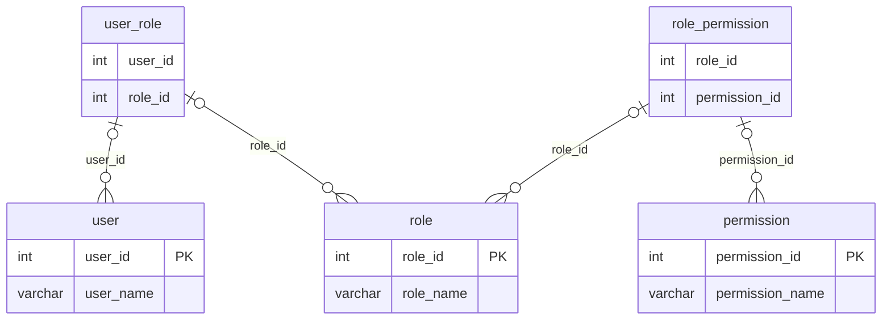
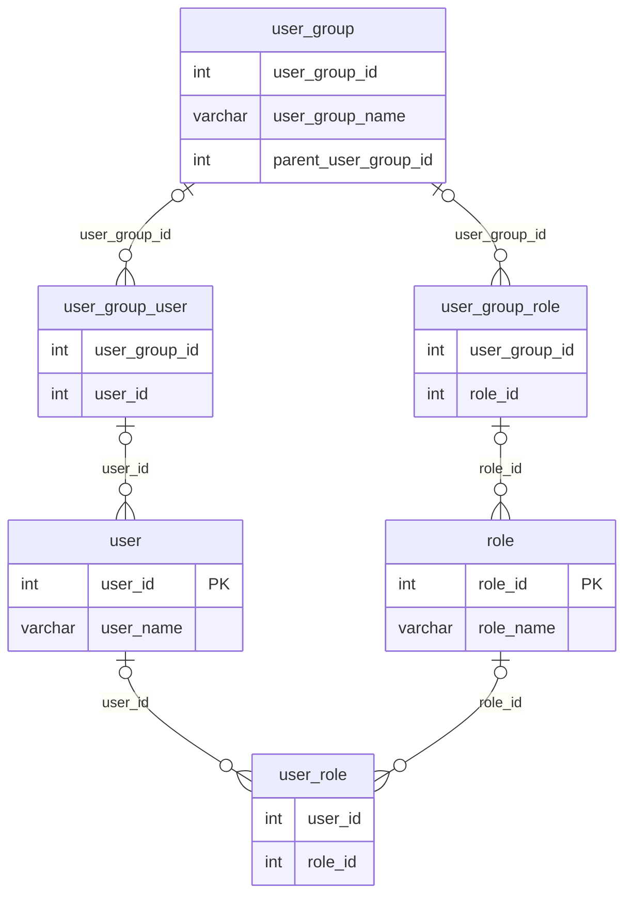
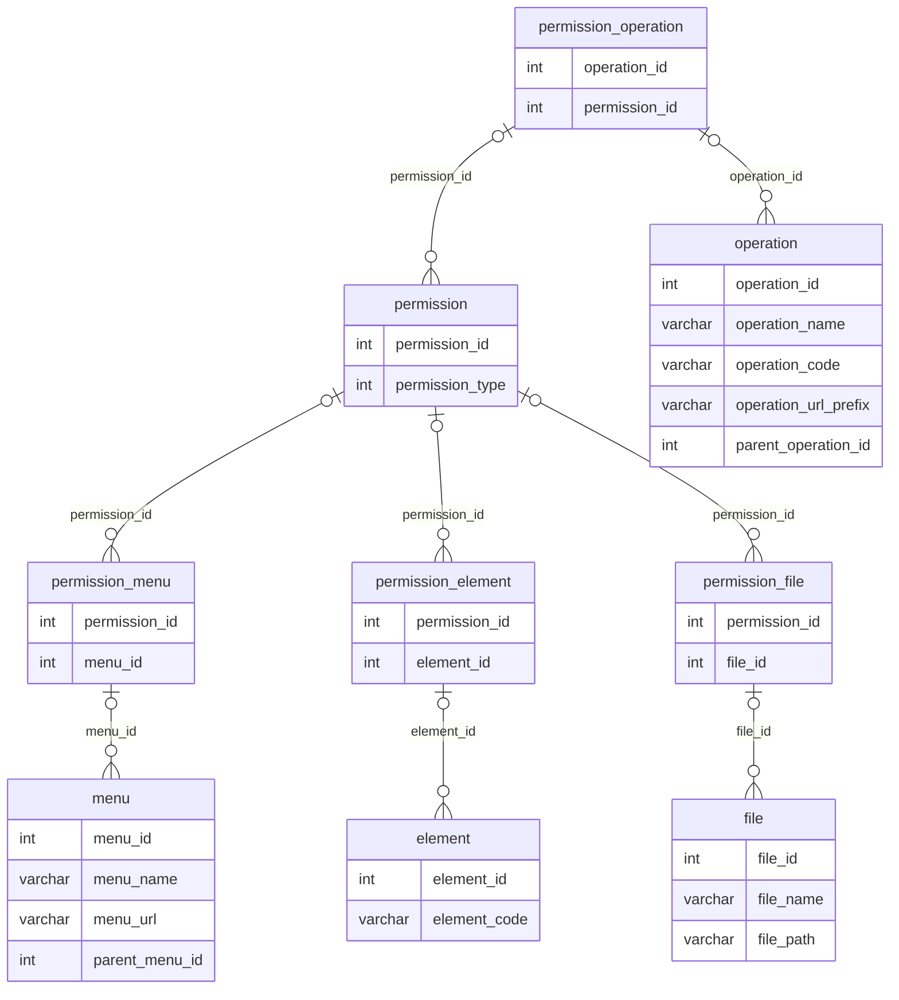
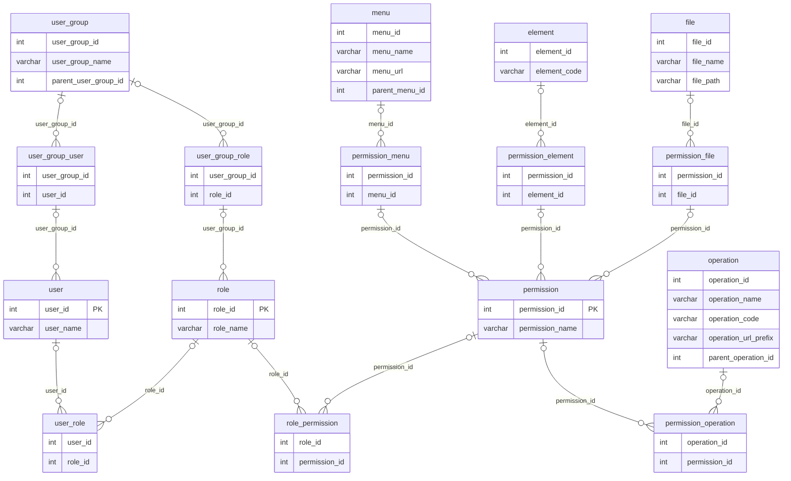

## RBAC概述

在20世纪90年代期间，大量的专家学者和专门研究单位对RBAC的概念进行了深入研究，先后提出了许多类型的RBAC模型，其中以美国George Mason大学信息安全技术实验室(LIST)提出的`RBAC96模型`最具有系统性，得到普遍的公认。

RBAC(Role-Based Access Control)是一种广泛应用于`访问控制`的权限模型。它定义了`基于角色`的访问控制策略，将用户权限赋予特定角色，而不是直接授予用户。这样做的好处是简化了权限管理，提高了系统的可扩展性和灵活性。

RBAC模型中包含以下几个核心概念：

- 角色(Role)：定义了一组相关权限的集合，可以授予给用户。
- 权限(Permission)：系统中定义的具体操作或资源访问权限。
- 用户(User)：系统中的实际用户，拥有一个或多个角色。
- 授权(Authorization)：将角色赋予用户，使其具有相应的权限。

RBAC支持公认的安全原则：最小特权原则、责任分离原则和数据抽象原则。

- 最小特权原则：在RBAC模型中可以通过限制分配给角色权限的多少和大小来实现，分配给与某用户对应的角色的权限只要不超过该用户完成其任务的需要就可以了。
- 责任分离原则：在RBAC模型中可以通过在完成敏感任务过程中分配两个责任上互相约束的两个角色来实现，例如在清查账目时，只需要设置财务管理员和会计两个角色参加就可以了。
- 数据抽象原则：是借助于抽象许可权这样的概念实现的，如在账目管理活动中，可以使用信用、借方等抽象许可权，而不是使用操作系统提供的读、写、执行等具体的许可权。但RBAC并不强迫实现这些原则，安全管理员可以允许配置RBAC模型使它不支持这些原则。因此，RBAC支持数据抽象的程度与RBAC模型的实现细节有关。

## RBAC的几种模型

RBAC96是一个模型族，其中包括RBAC0~RBAC3四个概念性模型。

- RBAC0：也称为基本RBAC模型，定义了基本的RBAC概念，包括用户、角色和权限，以及将角色授权给用户。RBAC0没有考虑角色之间的继承关系。
- RBAC1：在RBAC0模型的基础上引入了`角色继承`的概念。角色继承允许一个角色继承另一个角色的权限，从而简化了权限管理。例如，可以将一个高级管理员角色定义为继承自基本管理员角色，高级管理员将拥有基本管理员的所有权限，并可以额外拥有自己的权限。
- RBAC2：在RBAC1模型的基础上引入了`约束`的概念。约束是对角色赋予权限的限制条件，可以基于时间、地点或其他上下文信息进行定义。通过引入约束，可以更加细粒度地控制权限的赋予和使用。
- RBAC3：在RBAC2模型的基础上引入了`属性`的概念。属性是用户或角色的附加信息，可以用于动态决定权限的赋予和使用。属性可以包括用户的部门、职位等信息，通过对属性的判断，可以实现更加动态的权限管理。

## RBAC模型数据库建模

### 传统RBAC权限数据库设计

该方式为`用户-角色-权限`的授权模型。在这种模型中，用户与角色之间，角色与权限之间，一般是多对多的关系。

### 基于角色扩展数据库设计

当用户的数量非常大时，要给系统每个用户逐一授权(授角色)，是件非常烦琐的事情。这时，就需要给用户分组，每个用户组内有多个用户。除了可给用户授权外，还可以给用户组授权。这样一来，用户拥有的所有权限，就是用户个人拥有的权限与该用户所在用户组拥有的权限之和。

### 基于权限扩展数据库设计

对功能模块的操作，对上传文件的删改，菜单的访问，甚至页面上某个按钮、某个图片的可见性控制，都属于权限的范畴。有些权限设计，会把功能操作作为一类，而把文件、菜单、页面元素等作为另一类，这样构成`用户-角色-权限-资源`的授权模型。而在做数据表建模时，可把功能操作和资源统一管理，也就是都直接与权限表进行关联，这样可能更具便捷性和易扩展性。

### 完整的RBAC扩展数据库设计

权限表中有一列`权限类型`，我们根据它的取值来区分是哪一类权限，如`MENU`表示菜单的访问权限、`OPERATION`表示功能模块的操作权限、`FILE`表示文件的修改权限、`ELEMENT`表示页面元素的可见性控制等。

权限表与权限菜单关联表、权限菜单关联表与菜单表都是`一对一`的关系(文件、页面权限点、功能操作等同理)。也就是每添加一个菜单，就得同时往这三个表中各插入一条记录。这样，可以不需要权限菜单关联表，让权限表与菜单表直接关联，此时，须在权限表中新增一列用来保存菜单的ID，权限表通过`权限类型`和这个ID来区分是种类型下的哪条记录。  

RBAC权限模型的扩展模型的完整设计图如下：

