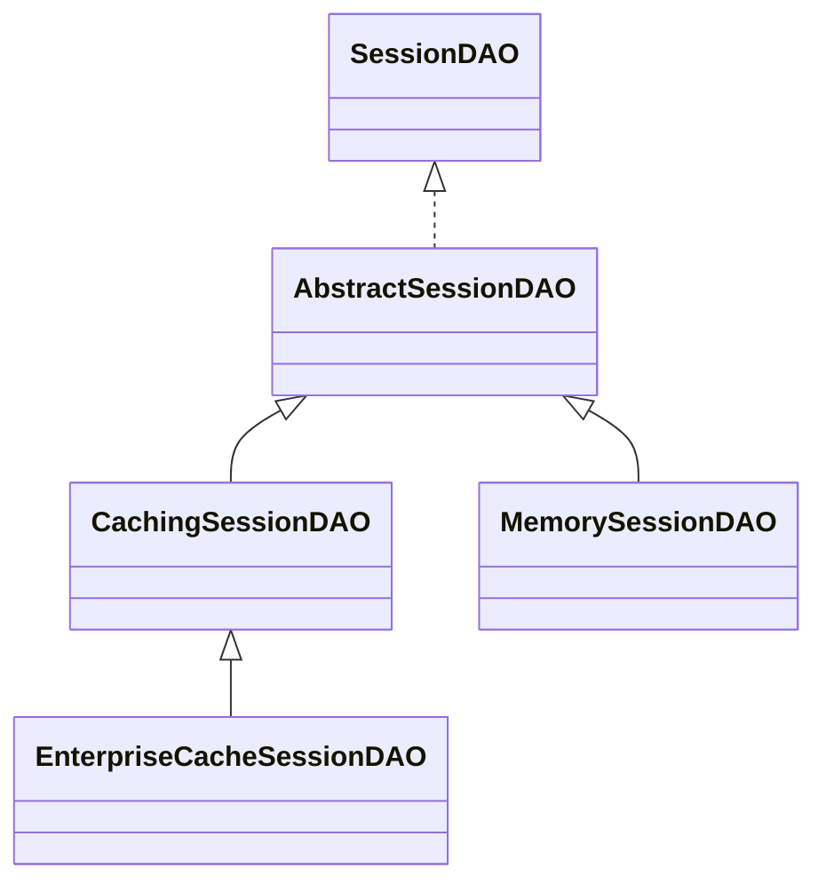

本文所使用的环境如下：

- IDEA：2021.1.3
- Shiro：1.3.2

## 简介

- Apache Shiro是Java的一个安全(权限)框架。
- Shiro可以很容易的开发出足够好的应用，其不仅可以用于JavaSE环境，也可以用在JavaEE环境。
- Shiro可以完成认证、授权、加密、会话管理、web集成、缓存等等。
- 官网地址：https://shiro.apache.org

## 功能

Shiro的基本功能如下图所示：


- **Authentication**：`身份认证/登录`。验证用户是不是拥有相应的身份。
- **Authorization**：`授权，即权限验证`。验证某个已认证的用户是否拥有某个权限，即判断用户是否能进行什么操作，如，验证某个用户是否拥有某个角色。或细粒度的验证某个用户对某个资源是否具有某个权限。
- **Session Management**：`会话管理`。即用户登录之后就是一次会话，在没有退出之前，它的所有信息都在会话中，会话可以是普通`JavaSE`环境，也可以是`Web`环境。
- **Cryptograph**：`加密`。保护数据的安全性，如密码加密存储到数据库，而不是明文存储。
- **Web Support**：`Web支持`。可以非常容易的集成到Web环境。
- **Caching**：`缓存`。比如用户登录后，其用户信息、拥有的角色/权限不必每次去查询，这样可以提高效率。
- **Concurrency**：Shiro支持`多线程应用的并发验证`。比如在一个线程中开启另一个线程，能把权限传播过去。
- **Testing**：提供`测试`支持。
- **Run As**：`允许一个用户假装为另一个用户(如果他们允许)`的身份进行访问。
- **Remember Me**：`记住我`。这个是非常常用的功能，即一次登录后，下次再访问就不必再登录了。

## Shiro架构

从Shiro外部来看，Shiro的架构图如下：


- **主体**：应用代码直接交互的对象是`Subject`，也就是说Shiro的对外`API核心`就是Subject。Subject代表了`当前用户`，这个用户不一定是一个具体的人，与当前应用交互的任何东西都是Subject，如网络爬虫，机器人等；与Subject的所有交互都会委托给`SecurityManager`；Subject其实是一个门面，SecurityManager才是实际的`执行者`。
- **SecurityManager**：安全管理器。即所有`与安全有关的操作都会与SecurityManager交互`，且它管理着所有Subject，可以看出它是`Shiro的核心`，它负责与Shiro的其他组件进行交互，如果学习过SpringMVC，你可以把它看成DispatcherServlet前端控制器。
- **Realm**：Shiro`从Realm获取安全数据(如用户、角色、权限)`，就是说SecurityManager要验证用户身份，那么它需要从Realm获取相应的用户进行比较以确定用户身份是否合法，也需要从Realm得到用户相应的角色/权限进行验证用户是否能进行操作，可以把Realm看成DataSource，即安全数据源。

从Shiro内部来看，Shiro的架构图如下：


- **Subject**：任何可以与应用交互的`用户`。
- **SecurityManager**：相当于SpringMVC中的DispatcherServlet，是Shiro的心脏。所有具体的交互都通过SecurityManager进行控制；它管理着所有`Subject、且负责进行认证和授权、及会话、缓存的管理`。
- **Authenticator**：`认证器,负责Subject认证`，这是一个扩展点，如果用户觉得Shiro默认的不好，可以自定义实现。可以使用`认证策略(Authentication Strategy)`，即什么情况下算用户认证通过了。
- **Authorizer**：`授权器`，或者访问控制器，用来决定主体是否有权限进行相应的操作，即控制着`用户能访问应用中的哪些功能`。
- **Realm**：可以有1个或多个Realm，可以认为是安全实体数据源，用于获取安全实体的。可以是`JDBC实现`，也可以是`LDAP`实现，或者`内存实现`等等，由用户提供。Shiro不知道你的用户/权限存储在哪及以何种格式存储；所以我们`一般在应用中都需要实现自己的Realm`。
- **SessionManager**：管理`Session生命周期`的组件，而Shiro并不仅仅可以用在Web环境，也可以用在普通的JavaSE环境。
- **SessionDAO**：DAO大家都用过，数据访问对象，用于会话的CRUD，比如我们想把Session保存到数据库，那么可以实现自己的SessionDAO，通过如JDBC写到数据库。比如想把Session放到Memcached中，可以实现自己的Memcached SessionDAO。另外SessionDAO中可以使用Cache进行缓存，以提高性能。
- **CacheManager**：`缓存控制器`，来管理如用户、角色、权限等的缓存的；因为这些数据基本上很少去改变，放到缓存中后可以提高访问的性能。
- **Cryptography**：`密码模块`，Shiro提供了一些常见的加密组件用于如密码加密/解密的。

## Spring整合Shiro

1. 创建web项目

   

   

   

2. 添加Shiro和Spring的jar包

   

3. 配置Spring和SpringMVC

   - web.xml

     ```xml
     <?xml version="1.0" encoding="UTF-8"?>
     <web-app xmlns="http://xmlns.jcp.org/xml/ns/javaee"
              xmlns:xsi="http://www.w3.org/2001/XMLSchema-instance"
              xsi:schemaLocation="http://xmlns.jcp.org/xml/ns/javaee http://xmlns.jcp.org/xml/ns/javaee/web-app_4_0.xsd"
              version="4.0">
     
         <context-param>
             <param-name>contextConfigLocation</param-name>
             <param-value>classpath:applicationContext.xml</param-value>
         </context-param>
     
         <listener>
             <listener-class>org.springframework.web.context.ContextLoaderListener</listener-class>
         </listener>
     
         <servlet>
             <servlet-name>spring</servlet-name>
             <servlet-class>org.springframework.web.servlet.DispatcherServlet</servlet-class>
             <load-on-startup>1</load-on-startup>
         </servlet>
         
         <servlet-mapping>
             <servlet-name>spring</servlet-name>
             <url-pattern>/</url-pattern>
         </servlet-mapping>
     </web-app>
     ```

   - applicationContext.xml

     ```xml
     <?xml version="1.0" encoding="UTF-8"?>
     <beans xmlns="http://www.springframework.org/schema/beans"
            xmlns:xsi="http://www.w3.org/2001/XMLSchema-instance"
            xsi:schemaLocation="http://www.springframework.org/schema/beans http://www.springframework.org/schema/beans/spring-beans.xsd">
     
     </beans>
     ```

   - 配置包扫描和视图解析

     ```xml
     <?xml version="1.0" encoding="UTF-8"?>
     <beans xmlns="http://www.springframework.org/schema/beans"
            xmlns:mvc="http://www.springframework.org/schema/mvc"
            xmlns:context="http://www.springframework.org/schema/context"
            xmlns:xsi="http://www.w3.org/2001/XMLSchema-instance"
            xsi:schemaLocation="http://www.springframework.org/schema/beans http://www.springframework.org/schema/beans/spring-beans.xsd
            http://www.springframework.org/schema/mvc http://www.springframework.org/schema/mvc/spring-mvc.xsd
            http://www.springframework.org/schema/context http://www.springframework.org/schema/context/spring-context.xsd">
     
         <context:component-scan base-package="com.yu.shiro" />
     
         <bean class="org.springframework.web.servlet.view.InternalResourceViewResolver">
             <property name="prefix" value="/" />
             <property name="suffix" value=".jsp" />
         </bean>
     
         <mvc:annotation-driven />
         <mvc:default-servlet-handler />
     </beans>
     ```

4. 配置Shiro

   - 添加shiro相关的jar包

     

   - web.xml中配置shiroFilter

     ```xml
     <?xml version="1.0" encoding="UTF-8"?>
     <web-app xmlns="http://xmlns.jcp.org/xml/ns/javaee"
              xmlns:xsi="http://www.w3.org/2001/XMLSchema-instance"
              xsi:schemaLocation="http://xmlns.jcp.org/xml/ns/javaee http://xmlns.jcp.org/xml/ns/javaee/web-app_4_0.xsd"
              version="4.0">
     
         <context-param>
             <param-name>contextConfigLocation</param-name>
             <param-value>classpath:applicationContext.xml</param-value>
         </context-param>
     
         <listener>
             <listener-class>org.springframework.web.context.ContextLoaderListener</listener-class>
         </listener>
     
         <servlet>
             <servlet-name>spring</servlet-name>
             <servlet-class>org.springframework.web.servlet.DispatcherServlet</servlet-class>
             <load-on-startup>1</load-on-startup>
         </servlet>
         
         <servlet-mapping>
             <servlet-name>spring</servlet-name>
             <url-pattern>/</url-pattern>
         </servlet-mapping>
     
         <!-- ==================================================================
              Filters
              ================================================================== -->
         <!-- Shiro Filter is defined in the spring application context: -->
         <!-- 配置shiroFilter -->
         <filter>
             <filter-name>shiroFilter</filter-name>
             <filter-class>org.springframework.web.filter.DelegatingFilterProxy</filter-class>
             <init-param>
                 <param-name>targetFilterLifecycle</param-name>
                 <param-value>true</param-value>
             </init-param>
         </filter>
     
         <filter-mapping>
             <filter-name>shiroFilter</filter-name>
             <url-pattern>/*</url-pattern>
         </filter-mapping>
     </web-app> 
     ```

   - 添加ehcache的jar包和配置文件

     ```tex
     ehcache-core-2.4.3.jar
     ```

     ```xml
     <?xml version="1.0" encoding="UTF-8"?>
     <ehcache xmlns:xsi="http://www.w3.org/2001/XMLSchema-instance"
              xsi:noNamespaceSchemaLocation="http://ehcache.org/ehcache.xsd">
     
         <!-- 默认缓存 -->
         <defaultCache
                 eternal="false"
                 timeToIdleSeconds="3600"
                 timeToLiveSeconds="3600"
                 overflowToDisk="false">
         </defaultCache>
     
         <!-- 登录记录缓存 锁定10分钟 -->
         <cache name="loginRecordCache"
                eternal="false"
                timeToIdleSeconds="600"
                timeToLiveSeconds="0"
                overflowToDisk="false"
                statistics="true">
         </cache>
     
     </ehcache>
     ```

   - 自定义realm

     ```java
     package com.yu.shiro.realm;
     
     import org.apache.shiro.authc.AuthenticationException;
     import org.apache.shiro.authc.AuthenticationInfo;
     import org.apache.shiro.authc.AuthenticationToken;
     import org.apache.shiro.realm.Realm;
     
     /**
      * 自定义realm
      *
      * @author elonlo
      * @date 2023/6/18 17:22
      */
     public class MyRealm implements Realm {
         @Override
         public String getName() {
             return null;
         }
     
         @Override
         public boolean supports(AuthenticationToken authenticationToken) {
             return false;
         }
     
         @Override
         public AuthenticationInfo getAuthenticationInfo(AuthenticationToken authenticationToken) throws AuthenticationException {
             return null;
         }
     }
     ```

   - 添加login.jsp、index.jsp、unauthorized.jsp

     ```jsp
     <%--
       Created by IntelliJ IDEA.
       User: elonlo
       Date: 2023/6/18
       Time: 14:03
       To change this template use File | Settings | File Templates.
     --%>
     <%@ page contentType="text/html;charset=UTF-8" language="java" %>
     <html>
       <body>
         <h3>please login in</h3>
       </body>
     </html>
     ```

     ```jsp
     <%--
       Created by IntelliJ IDEA.
       User: elonlo
       Date: 2023/6/18
       Time: 14:03
       To change this template use File | Settings | File Templates.
     --%>
     <%@ page contentType="text/html;charset=UTF-8" language="java" %>
     <html>
       <body>
         <h3>welcome to index</h3>
       </body>
     </html>
     ```

     ```jsp
     <%--
       Created by IntelliJ IDEA.
       User: elonlo
       Date: 2023/6/18
       Time: 14:03
       To change this template use File | Settings | File Templates.
     --%>
     <%@ page contentType="text/html;charset=UTF-8" language="java" %>
     <html>
       <body>
         <h3>403</h3>
       </body>
     </html>
     ```

   - 配置applicationContext.xml，实现spring整合shiro

     ```xml
     <?xml version="1.0" encoding="UTF-8"?>
     <beans xmlns="http://www.springframework.org/schema/beans"
            xmlns:xsi="http://www.w3.org/2001/XMLSchema-instance"
            xsi:schemaLocation="http://www.springframework.org/schema/beans http://www.springframework.org/schema/beans/spring-beans.xsd">
     
         <!-- =========================================================
              Shiro Core Components - Not Spring Specific
              ========================================================= -->
         <!-- Shiro's main business-tier object for web-enabled applications
              (use DefaultSecurityManager instead when there is no web environment)-->
         <!-- 1.配置securityManager -->
         <bean id="securityManager" class="org.apache.shiro.web.mgt.DefaultWebSecurityManager">
             <property name="cacheManager" ref="cacheManager"/>
             <!-- Single realm app.  If you have multiple realms, use the 'realms' property instead. -->
             <property name="realm" ref="jdbcRealm"/>
         </bean>
     
         <!-- Let's use some enterprise caching support for better performance.  You can replace this with any enterprise
              caching framework implementation that you like (Terracotta+Ehcache, Coherence, GigaSpaces, etc -->
         <!-- 2.配置cacheManager,添加ehcache的jar包和配置文件 -->
         <bean id="cacheManager" class="org.apache.shiro.cache.ehcache.EhCacheManager">
             <!-- Set a net.sf.ehcache.CacheManager instance here if you already have one.  If not, a new one
                  will be creaed with a default config:
                  <property name="cacheManager" ref="ehCacheManager"/> -->
             <!-- If you don't have a pre-built net.sf.ehcache.CacheManager instance to inject, but you want
                  a specific Ehcache configuration to be used, specify that here.  If you don't, a default
                  will be used.:-->
             <property name="cacheManagerConfigFile" value="classpath:ehcache.xml"/>
         </bean>
     
         <!-- Used by the SecurityManager to access security data (users, roles, etc).
              Many other realm implementations can be used too (PropertiesRealm,
              LdapRealm, etc. -->
         <!-- 3.配置realm -->
         <bean id="jdbcRealm" class="com.yu.shiro.realm.MyRealm" />
     
         <!-- =========================================================
              Shiro Spring-specific integration
              ========================================================= -->
         <!-- Post processor that automatically invokes init() and destroy() methods
              for Spring-configured Shiro objects so you don't have to
              1) specify an init-method and destroy-method attributes for every bean
                 definition and
              2) even know which Shiro objects require these methods to be
                 called. -->
         <!-- 4.配置LifecycleBeanPostProcessor,可以自动调用配置在Spring IOC容器中的shiro bean的生命周期方法 -->
         <bean id="lifecycleBeanPostProcessor" class="org.apache.shiro.spring.LifecycleBeanPostProcessor"/>
     
         <!-- Enable Shiro Annotations for Spring-configured beans.  Only run after
              the lifecycleBeanProcessor has run: -->
         <!-- 5.在IOC容器中使用shiro的注解,但是前提是必须先配置LifecycleBeanPostProcessor才能使用 -->
         <bean class="org.springframework.aop.framework.autoproxy.DefaultAdvisorAutoProxyCreator"
               depends-on="lifecycleBeanPostProcessor"/>
         <bean class="org.apache.shiro.spring.security.interceptor.AuthorizationAttributeSourceAdvisor">
             <property name="securityManager" ref="securityManager"/>
         </bean>
     
         <!-- Define the Shiro Filter here (as a FactoryBean) instead of directly in web.xml -
              web.xml uses the DelegatingFilterProxy to access this bean.  This allows us
              to wire things with more control as well utilize nice Spring things such as
              PropertiesPlaceholderConfigurer and abstract beans or anything else we might need: -->
         <!-- 配置shiroFilter,id必须和web.xml中配置的shiro过滤器名称一致 -->
         <bean id="shiroFilter" class="org.apache.shiro.spring.web.ShiroFilterFactoryBean">
             <property name="securityManager" ref="securityManager"/>
             <property name="loginUrl" value="login.jsp"/>
             <property name="successUrl" value="index.jsp"/>
             <property name="unauthorizedUrl" value="unauthorized.jsp"/>
             <!--
                 配置哪些页面需要受保护,以及访问这些页面需要的权限
                 anon: 可以被匿名访问
                 authc: 必须认证(即登录)后才能访问
              -->
             <property name="filterChainDefinitions">
                 <value>
                     /login.jsp = anon
     
                     # everything else requires authentication:
                     /** = authc
                 </value>
             </property>
         </bean>
     </beans>
     ```

5. 在applicationContext.xml中配置url权限

   [urls]部分的格式是：`url=拦截器[参数],拦截器[参数]`，如果当前请求的url匹配[urls]部分的某个url模式，将会执行其配置的拦截器。anon(anonymous)拦截器表示匿名访问(即不需要登录就能访问)，authc(authentication)拦截器表示需要身份认证后才能访问。

   - url匹配模式

     url模式使用`Ant风格`模式。Ant路径通配符支持`?、*、**`，注意通配符匹配不包括目录分隔符`/`。

     - ?：匹配一个字符。如`/admin?`将匹配`/admin1`，但不包括`/admin`或`/admin/`。
     - *：匹配零个或多个字符。如`/admin*`将匹配`/admin、/admin123`，但不包括`/admin/1`。
     - **：匹配路径中的零个或多个路径。如`/admin/**`将匹配`/admin/a`或`/admin/a/b`。

   - url匹配顺序

     url权限采取第一次匹配优先的方式，即从头开始第一个匹配的url模式对应的拦截器链。如`/bb/**=filter1、/bb/aa=filter2、/**=filter3`，如果请求的是`/bb/aa`，因为按照`声明顺序`进行匹配，那么将使用`filter1`进行拦截。

## 认证

### 认证流程

1. 获取当前的Subject，调用SecurityUtils.getSubject()。
2. 判断当前的用户是否已经被认证，即是否已登录，调用Subject的isAuthenticated()。
3. 若没有被认证，则把用户名和密码封装为UsernamePasswordToken对象。
   1. 创建一个表单页面。
   2. 把请求提交到SpringMVC的Handler。
   3. 获取用户名和密码。
4. 执行登录，调用Subject的login(AuthenticationToken)方法。
5. 自定义Realm的方法，从数据库中获取对应的记录，返回给Shiro。
   1. 继承org.apache.shiro.realm.AuthenticatingRealm类。
   2. 实现doGetAuthenticationInfo(AuthenticationToken)方法。
6. 由shiro完成密码的比对。

具体的代码示例如下：

- login.jsp、index.jsp、user.jsp

  ```jsp
  <%--
    Created by IntelliJ IDEA.
    User: elonlo
    Date: 2023/6/18
    Time: 14:03
    To change this template use File | Settings | File Templates.
  --%>
  <%@ page contentType="text/html;charset=UTF-8" language="java" %>
  <html>
    <body>
      <h3>please login in</h3>
  
      <form action="/shiro/login">
        <label>
          <input type="text" name="username" /><br><br>
  
          <input type="password" name="password" /><br><br>
  
          <input type="submit" name="submit" /><br><br>
        </label>
      </form>
    </body>
  </html>
  ```

  ```jsp
  <%--
    Created by IntelliJ IDEA.
    User: elonlo
    Date: 2023/6/18
    Time: 14:03
    To change this template use File | Settings | File Templates.
  --%>
  <%@ page contentType="text/html;charset=UTF-8" language="java" %>
  <html>
    <body>
      <h3>welcome to index</h3>
      <a href="/shiro/logout">logout</a>
    </body>
  </html>
  ```

  ```jsp
  <%--
    Created by IntelliJ IDEA.
    User: elonlo
    Date: 2023/6/18
    Time: 14:03
    To change this template use File | Settings | File Templates.
  --%>
  <%@ page contentType="text/html;charset=UTF-8" language="java" %>
  <html>
    <body>
      <h3>user page</h3>
    </body>
  </html>
  ```

- 配置url拦截器

  ```xml
  <bean id="shiroFilter" class="org.apache.shiro.spring.web.ShiroFilterFactoryBean">
      <property name="securityManager" ref="securityManager"/>
      <property name="loginUrl" value="login.jsp"/>
      <property name="successUrl" value="index.jsp"/>
      <property name="unauthorizedUrl" value="unauthorized.jsp"/>
      <!--
          配置哪些页面需要受保护,以及访问这些页面需要的权限
          anon: 可以被匿名访问
          authc: 必须认证(即登录)后才能访问
          logout: 登出
       -->
      <property name="filterChainDefinitions">
          <value>
              /login.jsp = anon
              /shiro/login = anon
              /shiro/logout = logout
  
              # everything else requires authentication:
              /** = authc
          </value>
      </property>
  </bean>
  ```

- Shiro处理器

  ```java
  package com.yu.shiro.handlers;
  
  import org.apache.shiro.SecurityUtils;
  import org.apache.shiro.authc.AuthenticationException;
  import org.apache.shiro.authc.UsernamePasswordToken;
  import org.apache.shiro.subject.Subject;
  import org.springframework.stereotype.Controller;
  import org.springframework.web.bind.annotation.RequestMapping;
  import org.springframework.web.bind.annotation.RequestParam;
  
  /**
   * Shiro处理器
   *
   * @author elonlo
   * @date 2023/6/18 20:49
   */
  @Controller
  @RequestMapping("/shiro")
  public class ShiroHandler {
  
      @RequestMapping("/login")
      public String login(@RequestParam("username") String username,
                          @RequestParam("password") String password) {
  
          // 获取subject
          Subject subject = SecurityUtils.getSubject();
  
          // 判断当前用户是否已经被认证
          if (!subject.isAuthenticated()) {
              // 将用户名和密码封装为UsernamePasswordToken对象
              UsernamePasswordToken token = new UsernamePasswordToken(username, password);
  
              // 记住我
              token.setRememberMe(true);
  
              try {
                  // 登录
                  subject.login(token);
              } catch (AuthenticationException e) {
                  System.out.println("登录失败: " + e.getMessage());
              }
          }
          return "redirect:/index.jsp";
      }
  }
  ```

- 自定义realm实现认证逻辑

  ```java
  package com.yu.shiro.realm;
  
  import org.apache.shiro.authc.*;
  import org.apache.shiro.realm.AuthenticatingRealm;
  
  /**
   * 自定义realm
   *
   * @author elonlo
   * @date 2023/6/18 17:22
   */
  public class MyRealm extends AuthenticatingRealm {
  
      @Override
      protected AuthenticationInfo doGetAuthenticationInfo(AuthenticationToken token) throws AuthenticationException {
          // 1.将AuthenticationToken转为UsernamePasswordToken
          UsernamePasswordToken usernamePasswordToken = (UsernamePasswordToken) token;
  
          // 2.从UsernamePasswordToken获取username
          String username = usernamePasswordToken.getUsername();
  
          // 3.调用数据库,从数据库中查询username对应的用户记录
          System.out.println("用户" + username + "的数据库记录信息");
  
          // 4.若用户不存在,则可以抛出UnknownAccountException异常
          if ("test".equals(username)) {
              throw new UnknownAccountException("用户不存在!");
          }
  
          // 5.根据查询的用户信息,判断是否要抛出其他的AuthenticationException异常
          if ("guest".equals(username)) {
              throw new LockedAccountException("账户被锁定!");
          }
  
          // 6.根据用户信息构建AuthenticationInfo对象并返回,通常使用的实现类为SimpleAuthenticationInfo
          // principal: 认证的实体信息,可以是username,也可以是数据表对应的用户的实体类对象
          Object principal = username;
          // credentials: 密码
          Object credentials = "1qaz!";
          // realmName: 当前realm对象的name,调用父类的getName()即可
          String realmName = getName();
  
          return new SimpleAuthenticationInfo(principal, credentials, realmName);
      }
  }
  ```

### Shiro密码加密验证

### MD5加密

- 设置加密算法

  ```xml
  <bean id="jdbcRealm" class="com.yu.shiro.realm.MyRealm">
      <property name="credentialsMatcher">
          <bean class="org.apache.shiro.authc.credential.HashedCredentialsMatcher">
              <!-- 指定加密算法 -->
              <property name="hashAlgorithmName" value="MD5"/>
              <!-- 指定加密次数 -->
              <property name="hashIterations" value="1024"/>
          </bean>
      </property>
  </bean>
  ```

- 加密方法

  ```java
  public static void main(String[] args) {
      String algorithmName = "MD5";
      Object credentials = "1qaz!@";
      Object salt = null;
      int hashIterations = 1024;
  
      Object result = new SimpleHash(algorithmName, credentials, salt, hashIterations);
      System.out.println(result);
  }
  ```

- 与数据库密码匹配

  ```java
  @Override
  protected AuthenticationInfo doGetAuthenticationInfo(AuthenticationToken token) throws AuthenticationException {
      // 1.将AuthenticationToken转为UsernamePasswordToken
      UsernamePasswordToken usernamePasswordToken = (UsernamePasswordToken) token;
  
      // 2.从UsernamePasswordToken获取username
      String username = usernamePasswordToken.getUsername();
  
      // 3.调用数据库,从数据库中查询username对应的用户记录
      System.out.println("用户" + username + "的数据库记录信息");
  
      // 4.若用户不存在,则可以抛出UnknownAccountException异常
      if ("test".equals(username)) {
          throw new UnknownAccountException("用户不存在!");
      }
  
      // 5.根据查询的用户信息,判断是否要抛出其他的AuthenticationException异常
      if ("guest".equals(username)) {
          throw new LockedAccountException("账户被锁定!");
      }
  
      // 6.根据用户信息构建AuthenticationInfo对象并返回,通常使用的实现类为SimpleAuthenticationInfo
      // principal: 认证的实体信息,可以是username,也可以是数据表对应的用户的实体类对象
      Object principal = username;
      // credentials: 数据库中的密码
      Object credentials = "986305112c14e0204b0e5cf410d5b302";
      // realmName: 当前realm对象的name,调用父类的getName()即可
      String realmName = getName();
  
      return new SimpleAuthenticationInfo(principal, credentials, realmName);
  }
  ```

<span style="color:red">注：以上配置主要是将用户输入的密码进行加密，然后与数据库中的密码进行匹配</span>

### MD5盐值加密

主要使用SimpleAuthenticationInfo类的构造器`SimpleAuthenticationInfo(Object principal, Object hashedCredentials, ByteSource credentialsSalt, String realmName)`实现，使用`ByteSource.Util.bytes(String string)`方法生成盐值。

```java
@Override
protected AuthenticationInfo doGetAuthenticationInfo(AuthenticationToken token) throws AuthenticationException {
    // 1.将AuthenticationToken转为UsernamePasswordToken
    UsernamePasswordToken usernamePasswordToken = (UsernamePasswordToken) token;

    // 2.从UsernamePasswordToken获取username
    String username = usernamePasswordToken.getUsername();

    // 3.调用数据库,从数据库中查询username对应的用户记录
    System.out.println("用户" + username + "的数据库记录信息");

    // 4.若用户不存在,则可以抛出UnknownAccountException异常
    if ("test".equals(username)) {
        throw new UnknownAccountException("用户不存在!");
    }

    // 5.根据查询的用户信息,判断是否要抛出其他的AuthenticationException异常
    if ("guest".equals(username)) {
        throw new LockedAccountException("账户被锁定!");
    }

    // 6.根据用户信息构建AuthenticationInfo对象并返回,通常使用的实现类为SimpleAuthenticationInfo
    // principal: 认证的实体信息,可以是username,也可以是数据表对应的用户的实体类对象
    Object principal = username;
    Object credentials = null;
    // credentials: 数据库中的密码
    if ("admin".equals(username)) {
        credentials = "6536c0250b93dc83fd780be4a9cefbbd";
    } else if ("user".equals(username)) {
        credentials = "04f66380c87589f0572d1f407ca5b160";
    }
    // realmName: 当前realm对象的name,调用父类的getName()即可
    String realmName = getName();
    // salt: 盐值,一般为唯一字符串,这里使用username作为盐值
    ByteSource credentialsSalt = ByteSource.Util.bytes(username);

    return new SimpleAuthenticationInfo(principal, credentials, credentialsSalt, realmName);
}
```

<span style="color:red">注：盐值需要唯一，一般使用随机字符串或user id</span>

### 多Realm认证

```java
public class MyRealm extends AuthenticatingRealm {

    @Override
    protected AuthenticationInfo doGetAuthenticationInfo(AuthenticationToken token) throws AuthenticationException {
        System.out.println("my realm......");
        // 1.将AuthenticationToken转为UsernamePasswordToken
        UsernamePasswordToken usernamePasswordToken = (UsernamePasswordToken) token;

        // 2.从UsernamePasswordToken获取username
        String username = usernamePasswordToken.getUsername();

        // 3.调用数据库,从数据库中查询username对应的用户记录
        System.out.println("用户" + username + "的数据库记录信息");

        // 4.若用户不存在,则可以抛出UnknownAccountException异常
        if ("test".equals(username)) {
            throw new UnknownAccountException("用户不存在!");
        }

        // 5.根据查询的用户信息,判断是否要抛出其他的AuthenticationException异常
        if ("guest".equals(username)) {
            throw new LockedAccountException("账户被锁定!");
        }

        // 6.根据用户信息构建AuthenticationInfo对象并返回,通常使用的实现类为SimpleAuthenticationInfo
        // principal: 认证的实体信息,可以是username,也可以是数据表对应的用户的实体类对象
        Object principal = username;
        Object credentials = null;
        // credentials: 数据库中的密码
        if ("admin".equals(username)) {
            credentials = "6536c0250b93dc83fd780be4a9cefbbd";
        } else if ("user".equals(username)) {
            credentials = "04f66380c87589f0572d1f407ca5b160";
        }
        // realmName: 当前realm对象的name,调用父类的getName()即可
        String realmName = getName();
        // salt: 盐值,一般为唯一字符串,这里使用username作为盐值
        ByteSource credentialsSalt = ByteSource.Util.bytes(username);

        return new SimpleAuthenticationInfo(principal, credentials, credentialsSalt, realmName);
    }

    public static void main(String[] args) {
        String algorithmName = "MD5";
        Object credentials = "1qaz!@";
        Object salt = ByteSource.Util.bytes("user");
        int hashIterations = 1024;

        Object result = new SimpleHash(algorithmName, credentials, salt, hashIterations);
        System.out.println(result);
    }
}
```

```java
public class SecondRealm extends AuthenticatingRealm {

    @Override
    protected AuthenticationInfo doGetAuthenticationInfo(AuthenticationToken token) throws AuthenticationException {
        System.out.println("second realm......");
        // 1.将AuthenticationToken转为UsernamePasswordToken
        UsernamePasswordToken usernamePasswordToken = (UsernamePasswordToken) token;

        // 2.从UsernamePasswordToken获取username
        String username = usernamePasswordToken.getUsername();

        // 3.调用数据库,从数据库中查询username对应的用户记录
        System.out.println("用户" + username + "的数据库记录信息");

        // 4.若用户不存在,则可以抛出UnknownAccountException异常
        if ("test".equals(username)) {
            throw new UnknownAccountException("用户不存在!");
        }

        // 5.根据查询的用户信息,判断是否要抛出其他的AuthenticationException异常
        if ("guest".equals(username)) {
            throw new LockedAccountException("账户被锁定!");
        }

        // 6.根据用户信息构建AuthenticationInfo对象并返回,通常使用的实现类为SimpleAuthenticationInfo
        // principal: 认证的实体信息,可以是username,也可以是数据表对应的用户的实体类对象
        Object principal = username;
        Object credentials = null;
        // credentials: 数据库中的密码
        if ("admin".equals(username)) {
            credentials = "4e543728b5bcf4433d4bde61e76217e919bcf71f";
        } else if ("user".equals(username)) {
            credentials = "400076b2287bfe40be100496475a5c8559e4ca3f";
        }
        // realmName: 当前realm对象的name,调用父类的getName()即可
        String realmName = getName();
        // salt: 盐值,一般为唯一字符串,这里使用username作为盐值
        ByteSource credentialsSalt = ByteSource.Util.bytes(username);

        return new SimpleAuthenticationInfo(principal, credentials, credentialsSalt, realmName);
    }

    public static void main(String[] args) {
        String algorithmName = "SHA1";
        Object credentials = "1qaz!@";
        Object salt = ByteSource.Util.bytes("admin");
        int hashIterations = 1024;

        Object result = new SimpleHash(algorithmName, credentials, salt, hashIterations);
        System.out.println(result);
    }
}
```

```xml
<!-- 配置多realm -->
<bean name="authenticator" class="org.apache.shiro.authc.pam.ModularRealmAuthenticator">
    <property name="realms">
        <list>
            <ref bean="jdbcRealm"/>
            <ref bean="secondRealm"/>
        </list>
    </property>
</bean>

<!-- 1.配置securityManager -->
<bean id="securityManager" class="org.apache.shiro.web.mgt.DefaultWebSecurityManager">
    <property name="cacheManager" ref="cacheManager"/>
    <!-- Single realm app.  If you have multiple realms, use the 'realms' property instead. -->
    <property name="authenticator" ref="authenticator"/>
</bean>

<!-- 3.配置realm -->
<bean id="jdbcRealm" class="com.yu.shiro.realm.MyRealm">
    <property name="credentialsMatcher">
        <bean class="org.apache.shiro.authc.credential.HashedCredentialsMatcher">
            <!-- 指定加密算法 -->
            <property name="hashAlgorithmName" value="MD5"/>
            <!-- 指定加密次数 -->
            <property name="hashIterations" value="1024"/>
        </bean>
    </property>
</bean>

<bean id="secondRealm" class="com.yu.shiro.realm.SecondRealm">
    <property name="credentialsMatcher">
        <bean class="org.apache.shiro.authc.credential.HashedCredentialsMatcher">
            <!-- 指定加密算法 -->
            <property name="hashAlgorithmName" value="SHA1"/>
            <!-- 指定加密次数 -->
            <property name="hashIterations" value="1024"/>
        </bean>
    </property>
</bean>
```

### 认证策略

Shiro的认证策略主要是通过`AuthenticcationStrategy接口`实现的，AuthenticcationStrategy接口有以下几种实现方式：

- **FirstSuccessfulStrategy**：`只要有一个Realm验证成功`即可，只`返回第一个Realm身份验证成功`的认证信息，其他的忽略。
- **AtLeastOneSuccessfulStrategy**：`只要有一个realm验证成功`即可，和FirstSuccessfulStrategy不同，将`返回所有Relam身份验证成功`的认证信息。
- **AllSuccessfulStrategy**：`所有Realm验证成功`才算成功，且返回所有Relam身份验证成功，如果有一个失败就失败了。

`ModularRealmAuthenticator`默认是AtLeastOneSuccessfulStrategy策略。

修改认证策略的方式如下：

```xml
<bean name="authenticator" class="org.apache.shiro.authc.pam.ModularRealmAuthenticator">
    <property name="realms">
        <list>
            <ref bean="jdbcRealm"/>
            <ref bean="secondRealm"/>
        </list>
    </property>
    <!-- 修改默认认证策略 -->
    <property name="authenticationStrategy">
        <bean class="org.apache.shiro.authc.pam.AllSuccessfulStrategy"/>
    </property>
</bean>
```

### SecurityManager配置Realm

```xml
<bean name="authenticator" class="org.apache.shiro.authc.pam.ModularRealmAuthenticator">
    <!-- 修改默认认证策略 -->
    <property name="authenticationStrategy">
        <bean class="org.apache.shiro.authc.pam.AllSuccessfulStrategy"/>
    </property>
</bean>

<bean id="securityManager" class="org.apache.shiro.web.mgt.DefaultWebSecurityManager">
    <property name="cacheManager" ref="cacheManager"/>
    <!-- Single realm app.  If you have multiple realms, use the 'realms' property instead. -->
    <property name="authenticator" ref="authenticator"/>
    <!-- 配置多realm -->
    <property name="realms">
        <list>
            <ref bean="jdbcRealm"/>
            <ref bean="secondRealm"/>
        </list>
    </property>
</bean>
```

## 授权

授权，也叫`访问控制`，即在应用中`控制谁访问哪些资源(如访问页面/编辑数据/页面操作等)`。在授权中需要了解几个关键对象：主体(Subject)、资源(Resource)、权限(Permission)、角色(Role)。

- **主体(Subject)**：访问应用的用户，在Shiro中使用`Subject`代表该用户。用户只有授权后才允许访问相应的资源。
- **资源(Resource)**：在应用中`用户可以访问的URL`，比如访问JSP页面、查看/编辑某些数据、访问某个业务方法、打印文本等等都是资源，用户只有授权后才能访问。
- **权限(Permission)**：安全策略中的原子授权单位，通过权限我们可以判断应用中用户有没有操作某个资源的权力。即权限表示`在应用中用户能不能访问某个资源`，如访问用户页面查看/新增/修改/删除用户数据等。权限表示了用户有没有操作某个资源的权力，即反映在某个资源上的操作允不允许。Shiro支持粗粒度权限(如用户模块的所有权限)和细粒度权限(操作某个用户的权限，即实例级别的)。
- **角色(Role)**：权限的集合，一般情况下会赋予用户角色而不是权限，即这样用户可以拥有一组权限，赋予权限时比较方便。典型的如：项目经理、技术总监、CTO、开发工程师等都是角色，不同的角色拥有一组不同的权限。

Shiro支持三种方式的授权：编程式、注解式、JSP/GSP标签。

- **编程式**：通过写if-else授权代码块完成。
- **注解式**：通过在执行的Java方法上放置相应的注解完成，没有权限将抛出相应的异常。
- **JSP/GSP标签**：在JSP/GSP页面通过相应的标签完成。

### 默认过滤器器

Shiro内置了很多默认的过滤器，比如身份验证、授权等相关的。默认过滤器可以参考`org.apache.shiro.web.filter.mgt.DefaultFilter`中的过滤器。

Shiro`身份认证`相关的常见过滤器如下表所示：

|   过滤器   |          过滤器全称           |                             功能                             |
| :--------: | :---------------------------: | :----------------------------------------------------------: |
|    anon    |        AnonymousFilter        |                     指定url可以匿名访问                      |
|   authc    |   FormAuthenticationFilter    | 基于表单的拦截器，如`/**=authc`，如果没有登录会跳到相应的登录页面登录。主要属性：usernameParam：表单提交的用户名参数名(username)； passwordParam：表单提交的密码参数名(password)； rememberMeParam：表单提交的密码参数名(rememberMe)； loginUrl：登录页面地址(/login.jsp)；successUrl：登录成功后的默认重定向地址； failureKeyAttribute：登录失败后错误信息存储key(shiroLoginFailure) |
| authcBasic | BasicHttpAuthenticationFilter | Basic HTTP身份验证拦截器。主要属性： applicationName：弹出登录框显示的信息(application) |
|   logout   |      authc.LogoutFilter       | 退出拦截器。主要属性：redirectUrl：退出成功后重定向的地址(/) |
|    user    |          UserFilter           |        用户拦截器，用户已经身份验证/记住我登录的都可         |

Shiro`授权`相关的常见过滤器如下表所示：

|      过滤器       |              过滤器全称              |                             功能                             |
| :---------------: | :----------------------------------: | :----------------------------------------------------------: |
|       roles       |       RolesAuthorizationFilter       | 角色授权拦截器，验证用户是否拥有所有角色。主要属性： loginUrl：登录页面地址(/login.jsp)；unauthorizedUrl：未授权后重定向的地址，示例`/admin/**=roles[admin]` |
|       perms       |    PermissionsAuthorizationFilter    | 权限授权拦截器，验证用户是否拥有所有权限，属性和roles一样。示例`/user/**=perms[“user:create”]` |
|       port        |              PortFilter              | 端口拦截器。主要属性：port(80)：可以通过的端口，示例`/test= port[80]`，如果用户访问该页面是非80，将自动将请求端口改为80并重定向到该80端口，其他路径/参数等都一样 |
|       rest        |      HttpMethodPermissionFilter      | rest风格拦截器，自动根据请求方法构建权限字符串(GET=read, POST=create,PUT=update,DELETE=delete,HEAD=read,TRACE=read,OPTIONS=read, MKCOL=create)构建权限字符串；示例`/users=rest[user]`，会自动拼出`user:read,user:create,user:update,user:delete`权限字符串进行权限匹配(所有都得匹配，isPermittedAll) |
|        ssl        |              SslFilter               | SSL拦截器，只有请求协议是https才能通过，否则自动跳转会https端口(443)；其他和port拦截器一样 |
| noSessionCreation | NoSessionCreationAuthorizationFilter |                     需要指定权限才能访问                     |

### Permissions

- **规则**：`资源标识符:操作:对象实例ID`，即对哪个资源的哪个实例可以进行什么操作，其默认支持通配符权限字符串，`:`表示资源/操作/实例的分割，`,`表示操作的分割，`*`表示任意资源/操作/实例。
- **多层次管理**：
  - **单个权限授权**：`:`是一个特殊字符串，它用来分割权限字符串的下一部件。第一部分是权限被操作的某个领域，第二部分是被执行的操作。如：`user:query`，`user:edit`等。
  - **多个权限授权**：每个部件可以保护多个值，因此，除了使用`user:query`，`user:edit`表示外，也可以使用`user:query,edit`。
  - **通配符授权**：也可以使用通配符`*`代替所有的值，如：`user:*`，也可以写`*:query`，表示所有用户都有query的权限。

### 权限配置

- index.jsp

  ```jsp
  <%--
    Created by IntelliJ IDEA.
    User: elonlo
    Date: 2023/6/18
    Time: 14:03
    To change this template use File | Settings | File Templates.
  --%>
  <%@ page contentType="text/html;charset=UTF-8" language="java" %>
  <html>
    <body>
      <h3>welcome to index</h3>
  
      <a href="user.jsp">user page</a><br><br>
  
      <a href="admin.jsp">admin page</a><br><br>
  
      <a href="/shiro/logout">logout</a>
    </body>
  </html>
  ```

- applicationContext.xml

  ```xml
  <bean id="shiroFilter" class="org.apache.shiro.spring.web.ShiroFilterFactoryBean">
      <property name="securityManager" ref="securityManager"/>
      <property name="loginUrl" value="login.jsp"/>
      <property name="successUrl" value="index.jsp"/>
      <property name="unauthorizedUrl" value="unauthorized.jsp"/>
      <!--
          配置哪些页面需要受保护,以及访问这些页面需要的权限
          anon: 可以被匿名访问
          authc: 必须认证(即登录)后才能访问
          logout: 登出
       -->
      <property name="filterChainDefinitions">
          <value>
              /login.jsp = anon
              /shiro/login = anon
              /shiro/logout = logout
              /user.jsp = roles[user]
              /admin.jsp = roles[admin]
  
              # everything else requires authentication:
              /** = authc
          </value>
      </property>
  </bean>
  ```

### 授权流程

1. 授权需要继承`AuthorizingRealm`，并实现其`doGetAuthorizationInfo`方法。
2. `AuthorizingRealm`继承自`AuthenticatingRealm`，所以认证、授权只需要继承`AuthorizingRealm`，并同时实现它的两个抽象方法就行。
3. 从PrincipalCollection中获取登录用户的信息。
4. 从登录用户的信息获取当前用户拥有的角色和权限(可能需要查询数据库)。
5. 创建simpleAuthorizationInfo，并设置roles属性。
6. 返回simpleAuthorizationInfo对象。

具体代码示例如下：

```java
public class MyRealm extends AuthorizingRealm {

    // 认证
    @Override
    protected AuthenticationInfo doGetAuthenticationInfo(AuthenticationToken token) throws AuthenticationException {
        System.out.println("my realm......");
        // 1.将AuthenticationToken转为UsernamePasswordToken
        UsernamePasswordToken usernamePasswordToken = (UsernamePasswordToken) token;

        // 2.从UsernamePasswordToken获取username
        String username = usernamePasswordToken.getUsername();

        // 3.调用数据库,从数据库中查询username对应的用户记录
        System.out.println("用户" + username + "的数据库记录信息");

        // 4.若用户不存在,则可以抛出UnknownAccountException异常
        if ("test".equals(username)) {
            throw new UnknownAccountException("用户不存在!");
        }

        // 5.根据查询的用户信息,判断是否要抛出其他的AuthenticationException异常
        if ("guest".equals(username)) {
            throw new LockedAccountException("账户被锁定!");
        }

        // 6.根据用户信息构建AuthenticationInfo对象并返回,通常使用的实现类为SimpleAuthenticationInfo
        // principal: 认证的实体信息,可以是username,也可以是数据表对应的用户的实体类对象
        Object principal = username;
        Object credentials = null;
        // credentials: 数据库中的密码
        if ("admin".equals(username)) {
            credentials = "6536c0250b93dc83fd780be4a9cefbbd";
        } else if ("user".equals(username)) {
            credentials = "04f66380c87589f0572d1f407ca5b160";
        }
        // realmName: 当前realm对象的name,调用父类的getName()即可
        String realmName = getName();
        // salt: 盐值,一般为唯一字符串,这里使用username作为盐值
        ByteSource credentialsSalt = ByteSource.Util.bytes(username);
        return new SimpleAuthenticationInfo(principal, credentials, credentialsSalt, realmName);
    }

    // 授权
    @Override
    protected AuthorizationInfo doGetAuthorizationInfo(PrincipalCollection principals) {
        // 1.从PrincipalCollection中获取登录用户的信息
        Object principal = principals.getPrimaryPrincipal();

        // 2.从登录用户的信息获取当前用户拥有的角色和权限(可能需要查询数据库)
        Set<String> roles = new HashSet<>(16);
        roles.add("user");
        if ("admin".equals(principal)) {
            roles.add("admin");
        }

        // 3.创建simpleAuthorizationInfo,并设置roles属性
        SimpleAuthorizationInfo simpleAuthorizationInfo = new SimpleAuthorizationInfo(roles);

        // 4.返回simpleAuthorizationInfo对象
        return simpleAuthorizationInfo;
    }

    public static void main(String[] args) {
        String algorithmName = "MD5";
        Object credentials = "1qaz!@";
        Object salt = ByteSource.Util.bytes("user");
        int hashIterations = 1024;
        Object result = new SimpleHash(algorithmName, credentials, salt, hashIterations);
        System.out.println(result);
    }
}
```

### Shiro标签

Shiro提供了`JSTL标签`用于在`JSP页面`进行权限控制，如根据登录用户显示相应的页面按钮。

- **guest标签**：用户`没有身份验证`时显示相应信息，即游客访问信息。
- **user标签**：用户`已经经过认证/记住我`登录后显示相应的信息。
- **authenticated标签**：用户已经身份验证通过，即`subject.login`登录成功，不是`记住我登录`的。
- **notAuthenticated标签**：用户未进行身份验证，即没有调用`subject.login`进行登录，`包括记住我自动登录`也属性未进行身份验证。
- **principal标签**：`显示用户身份信息`，默认调用`Subject.getPrincipals()`获取，即Primary Principal。
- **hasRole标签**：如果`当前Subject有角色`将显示body体内容。
- **hasAnyRoles标签**：如果`当前Subject有任意一个角色`将显示body体内容。
- lacksRoles标签：如果`当前Subject没有角色`将显示body体内容。
- hasPermission标签：如果`当前Subject有权限`将显示body体内容。
- lacksPermission标签：如果`当前Subject没有权限`将显示body体内容。

具体代码示例如下：

```jsp
<%@ page contentType="text/html;charset=UTF-8" language="java" %>
<%@ taglib prefix="shiro" uri="http://shiro.apache.org/tags" %>
<html>
  <body>
    <h3>welcome to index</h3>

    hello,<shiro:principal /><br><br>

    <shiro:hasRole name="user">
      <a href="user.jsp">user page</a><br><br>
    </shiro:hasRole>

    <shiro:lacksRole name="user">
      <shiro:principal />没有user角色<br><br>
    </shiro:lacksRole>

    <shiro:lacksPermission name="user">
      <shiro:principal />没有user权限<br><br>
    </shiro:lacksPermission>

    <shiro:hasRole name="admin">
      <a href="admin.jsp">admin page</a><br><br>
    </shiro:hasRole>

    <a href="/shiro/logout">logout</a>
  </body>
</html>
```

### 权限注解

- **@RequiresAuthentication**：表示当前Subject已经通过login进行了身份验证，即`subject.isAuthenticated()`返回true。
- **@RequiresUser**：表示当前subject`已经通过身份验证或者通过记住我登录`的。
- **@RequiresGuest**：表示当前subject`没有通过身份验证通过记住我登录`的，即游客身份。
- **@RequiresRoles(value = {"admin", "user"}, logical = Logical.AND)**：表示当前subject需要角色`admin`和`user`。
- **@RequiresPermissions(value = {"admin", "user"}, logical = Logical.OR)**：表示当前subject需要权限`user:a`或`user:b`

具体代码示例如下：

- 编写一个ShiroSerice类，并添加ShiroAnnotationTest方法和注解

  ```java
  public class ShiroService {
  
      @RequiresRoles({"admin"})
      public void ShiroAnnotationTest() {
          System.out.println("当前时间: " + new Date());
      }
  }
  ```

- application.xml中注入ShiroSerice

  ```xml
  <bean name="shiroService" class="com.yu.shiro.service.ShiroService"/>
  ```

-  ShiroHandler中添加ShiroAnnotationTest请求

  ```java
  @Autowired
  private ShiroService shiroService;
  
  @RequestMapping("/ShiroAnnotationTest")
  public String ShiroAnnotationTest() {
      shiroService.ShiroAnnotationTest();
      return "redirect:/index.jsp";
  }
  ```

- index.jsp中配置页面跳转

  ```jsp
  <%@ page contentType="text/html;charset=UTF-8" language="java" %>
  <%@ taglib prefix="shiro" uri="http://shiro.apache.org/tags" %>
  <html>
    <body>
      <h3>welcome to index</h3>
  
      hello,<shiro:principal /><br><br>
  
      <shiro:hasRole name="user">
        <a href="user.jsp">user page</a><br><br>
      </shiro:hasRole>
  
      <shiro:lacksRole name="user">
        <shiro:principal />没有user角色<br><br>
      </shiro:lacksRole>
  
      <shiro:lacksPermission name="user">
        <shiro:principal />没有user权限<br><br>
      </shiro:lacksPermission>
  
      <a href="/shiro/ShiroAnnotationTest">ShiroAnnotationTest</a><br><br>
  
      <shiro:hasRole name="admin">
        <a href="admin.jsp">admin page</a><br><br>
      </shiro:hasRole>
  
      <a href="/shiro/logout">logout</a>
    </body>
  </html>
  ```


### 从数据表中初始化资源和权限

- 创建实例工厂的map

  ```java
  public class FilterChainDefinitionMapBuilder {
  
      public LinkedHashMap<String, String> buildFilterChainDefinitionMap() {
          // 这里的过滤器信息一般是从数据库中查询出来的
          LinkedHashMap<String, String> hashMap = new LinkedHashMap<>();
          hashMap.put("/login.jsp", "anon");
          hashMap.put("/shiro/login", "anon");
          hashMap.put("/shiro/logout", "logout");
          hashMap.put("/**", "authc");
  
          return hashMap;
      }
  }
  ```

- 配置过滤器链

  ```xml
  <bean id="shiroFilter" class="org.apache.shiro.spring.web.ShiroFilterFactoryBean">
      <property name="securityManager" ref="securityManager"/>
      <property name="loginUrl" value="login.jsp"/>
      <property name="successUrl" value="index.jsp"/>
      <property name="unauthorizedUrl" value="unauthorized.jsp"/>
      <property name="filterChainDefinitionMap" ref="filterChainDefinitionMap" />
      <!--
          配置哪些页面需要受保护,以及访问这些页面需要的权限
          anon: 可以被匿名访问
          authc: 必须认证(即登录)后才能访问
          logout: 登出
       -->
      <!--<property name="filterChainDefinitions">
          <value>
              /login.jsp = anon
              /shiro/login = anon
              /shiro/logout = logout
              /user.jsp = roles[user]
              /admin.jsp = roles[admin]
  
              # everything else requires authentication:
              /** = authc
          </value>
      </property>-->
  </bean>
  
  <!-- 通过实例工厂的方式构建一个过滤器链的bean -->
  <bean id="filterChainDefinitionMap" factory-bean="filterChainDefinitionMapBuilder" factory-method="buildFilterChainDefinitionMap"/>
  
  <bean id="filterChainDefinitionMapBuilder" class="com.yu.shiro.factory.FilterChainDefinitionMapBuilder"/>
  ```

## 会话管理

Shiro提供了`完整的企业级会话管理`功能，`不依赖于底层容器(web或tomcat)`，支持`JavaS`E和`JavaEE`环境，提供了会话管理、会话监听、会话存储/持久化、容器无关的集群、失效/过期支持、对Web的透明支持、SSO单点登录的支持等特性。

### 会话相关的API

- **Subject.getSession()**：即可获取会话，等价于于Subject.getSession(true)，即如果当前没有创建Session对象会创建一个；Subject.getSession(false)，如果当前没有创建Session对象会返回null。
- **session.getId()**：获取当前会话的唯一标识。
- **session.getHost()**：获取当前Subject对象的主机地址。
- **session.getTimeout() & session.setTimeout(毫秒)**：获取/设置当前Session的过期时间。
- **session.getStartTimeStamp() & session.getLastAccessTime()**：获取会话的启动时间和最后访问时间，如果是`JavaSE应用`需要自己`定期`调用`session.touch()`去更新最后访问时间；如果是`Web应用`，每次进入`ShiroFilter`都会`自动`调用`session.touch()`来更新最后访问时间。
- **session.touch() & session.stop()**：更新会话的最后访问时间及销毁会话。当调用`Subject.logout()`时会自动调用stop方法来销毁会话，如果在Web中，调用`HttpSession.invlidate()`也会自动调用`session.stop()`方法销毁Shiro的会话。
- **session.setAttribute(key, val) & session.getAttribute(key, val) & session.removeAttribute(key, val)**：设置/获取/删除会话属性，在整个会话范围内都可以对这些属性进行操作。

具体代码示例如下：

- 添加servlet-api jar包

  ```tex
  servlet-api-2.5.jar
  ```

- 创建session会话和获取session

  ```java
  @Controller
  @RequestMapping("/shiro")
  public class ShiroHandler {
  
      @Autowired
      private ShiroService shiroService;
  
      @RequestMapping("/ShiroAnnotationTest")
      public String ShiroAnnotationTest(HttpSession session) {
          session.setAttribute("name", session);
          shiroService.ShiroAnnotationTest();
          return "redirect:/index.jsp";
      }
  }
  ```

  ```java
  public class ShiroService {
  
      @RequiresRoles({"admin"})
      public void ShiroAnnotationTest() {
          System.out.println("当前时间: " + new Date());
  
          Session session = SecurityUtils.getSubject().getSession();
          Object value = session.getAttribute("name");
          System.out.println("service session: " + value);
      }
  }
  ```

### 会话监听器

会话监听器用于监听会话创建、过期及停止事件。

- 实现SessionListener接口

  ```java
  public class MyListener implements SessionListener {
  
      // 会话创建
      @Override
      public void onStart(Session session) {
          System.out.println("会话创建: " + session.getId());
      }
  
      // 退出会话
      @Override
      public void onStop(Session session) {
          System.out.println("会话退出: " + session.getId());
      }
  
      // 会话过期
      @Override
      public void onExpiration(Session session) {
          System.out.println("会话过期: " + session.getId());
      }
  }
  ```

- applicationContext.xml配置会话监听器

  ```xml
  <!-- 自定义session监听器 -->
  <bean id="sessionManager" class="org.apache.shiro.web.session.mgt.DefaultWebSessionManager">
      <property name="sessionListeners" ref="sessionListener"/>
  </bean>
  
  <bean id="sessionListener" class="com.yu.shiro.listener.MyListener"/>
  ```

- 把sessionManager管理器交给securityManager

  ```xml
  <bean id="securityManager" class="org.apache.shiro.web.mgt.DefaultWebSecurityManager">
      <property name="cacheManager" ref="cacheManager"/>
      <!-- Single realm app.  If you have multiple realms, use the 'realms' property instead. -->
      <property name="authenticator" ref="authenticator"/>
      <!-- 配置多realm -->
      <property name="realms">
          <list>
              <ref bean="jdbcRealm"/>
              <ref bean="secondRealm"/>
          </list>
      </property>
      <property name="sessionManager" ref="sessionManager"/>
  </bean>
  ```


### SessionDAO

SessionDAO接口是Shiro中所有SessionDAO的顶级接口，给出了从持久层(一般而言是关系型数据库)操作session的标准。主要有以下几种实现：

- **AbstractSessionDAO**：AbstractSessionDAO提供了SessionDAO的`基础实现`，如生成会话ID等。
- **CachingSessionDAO**：CachingSessionDAO提供了对开发者透明的`会话缓存`的功能，需要设置相应的CacheManager。
- **MemorySessionDAO**：MemorySessionDAO直接在`内存中`进行会话维护。
- **EnterpriseCacheSessionDAO**：EnterpriseCacheSessionDAO提供了`缓存功能`的会话维护，默认情况下使用MapCache实现，内部使用ConcurrentHashMap保存缓存的会话。



## Remember Me

Shiro提供了记住我(RememberMe)的功能，比如访问淘宝等一些网站时，关闭了浏览器，下次再打开时还是能记住你是谁，而且无需再登录即可访问。

认证和记住我的区别如下：

- `subject.isAuthenticated()`表示用户是否进行了`身份验证`登录的，即使用`subject.login()`进行了登录。
- `subject.isRemembered()`表示用户是否通过`记住我`登录的，此时不一定是自己访问的。
- 这两种状态同一时刻只能存在一种，即要么认证登录，要么通过记住我登录。

建议如下：

- 访问一般网页，比如主页之类的，我们使用user拦截器即可，user拦截器只要用户登录(isAuthenticated() || isRemembered())通过即可访问。
- 访问订单，提交订单，支付等页面，我们使用auth拦截器，auth拦截器会判断用户是否是通过`subject.login(),即isAuthenticated() == true`登录的，如果是才放行，否则会跳转到登录页面提示重新登录。
