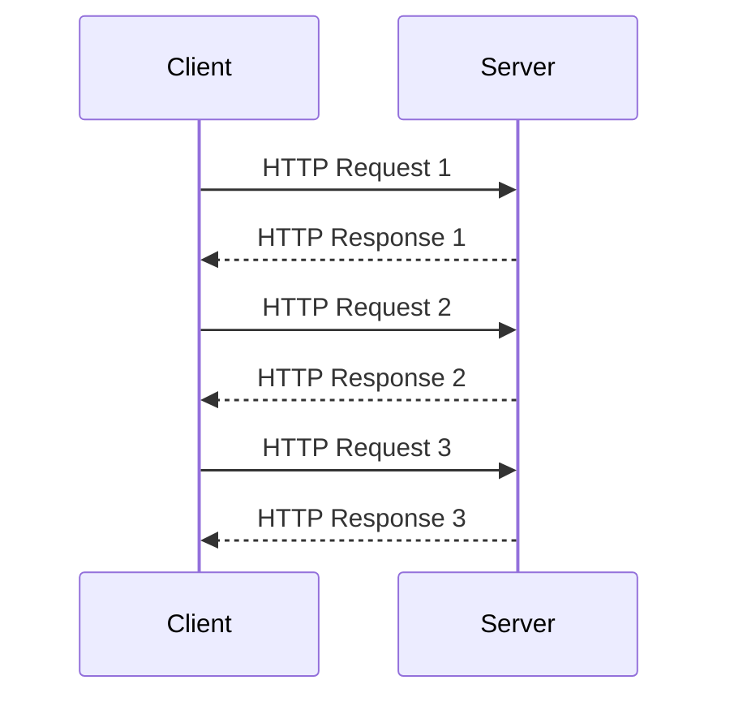
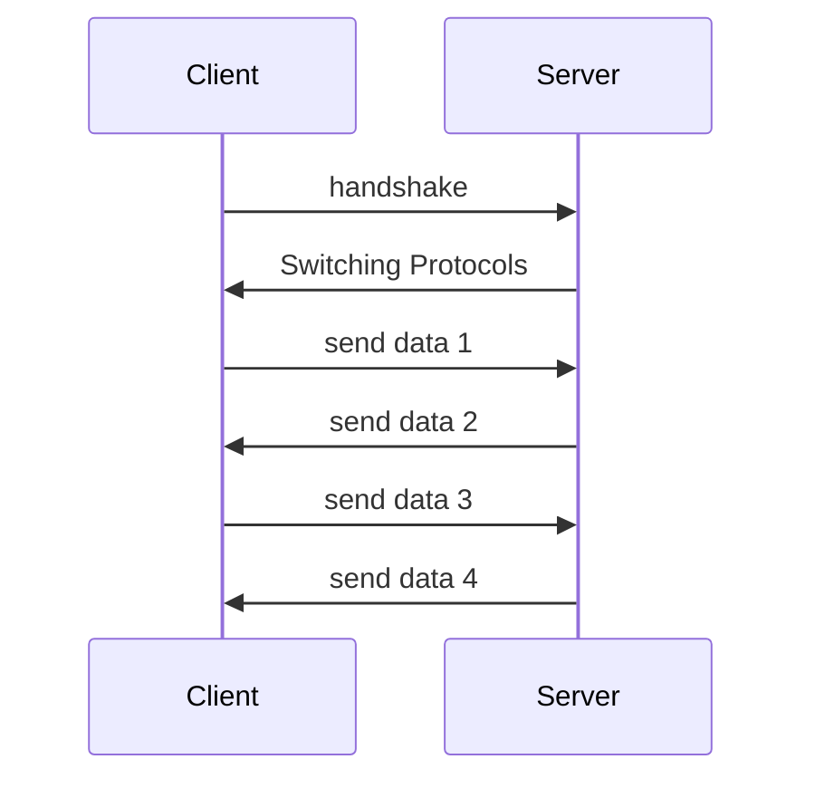

## 简介

WebSocket 是一种`网络通信协议`，RFC6455 定义了它的通信标准。

WebSocket 是 `HTML5` 开始提供的一种在`单个 TCP 连接`上进行`全双工通讯`的协议。

## HTTP协议



HTTP 是超文本传输协议，用于从 www 服务器传输超文本到本地浏览器的传输协议。http 是`基于 tcp 协议`的一个`应用层`的协议，由`请求和响应`构成；是一个`无状态`的协议。

这种通信模型的主要弊端是无法实现服务器主动向客户端发起消息。这种单向请求的特点，如果服务器有连续的状态变化，客户端获知会非常麻烦。大多数 Web 应用程序将通过频繁的异步 AJAX 请求实现长轮询。轮询的效率低，非常浪费资源。

工作过程如下：

> 1、客户端和服务端建立连接，http开始工作；
>
> 2、建立连接后客户端发送请求给服务器；
>
> 3、服务器收到请求后，给予相应的响应信息；
>
> 4、客户端接收服务器返回的数据并在浏览器上展示，然后客户端和服务器连接断开。

在这个过程中客户端和服务器之间的连接和断开是通过三次握手、四次挥手完成的。

**三次握手建立连接**

> 第一次：建立连接，客户端发送 SYN 包（SYN=i）到服务器，并进入 SYN_SEND 状态，等待服务器确认；
> 第二次：服务器接收 SYN 包，确认客户的 SYN ,同时也发送一个 SYN 包（SYN=k）+ ACK 包（ACK = i+1）给客户端，服务器进入 SYN_RECV 状态；
> 第三次：客户端接收到服务器的 SYN+ACK 包之后，同时向服务器发送确认包 ACK 包（ACK = k+1）,然后客户端和服务器进入ESTABLISHED 状态。

完成三次握手之后，客户端和服务器开始传输数据。

**四次挥手断开连接**

> 第一次：客户端发送一个 FIN（i） ，用来关闭客户端和服务器的数据传输，客户端进入 FIN_WAIT_1 状态；
> 第二次：服务器接收 FIN ，发送一个 ACK （i+1）给客户端，服务器进入 CLISE_WAIT 状态；
> 第三次：服务器发送一个 FIN （j） 给客户端用来关闭服务器到客户端的数据传输，服务器进入 LAST_ACK 状态；
> 第四次：客户端接收到 FIN 后，客户端进入 TIME_WAIT 状态，然后发送 ACK （j+1） 给服务器，校验完成之后服务器进入 CLOSED 状态。

**HTTPS**

https 就是加密的 http ，它通过 http 进行通信，利用 SSL/TLS 建立安全信道，加密数据包。是计算机网络进行安全通信的传输协议。

## WebSocket协议



WebSocket 允许服务器主动向客户端推送数据，客户端和服务器只需要完成`一次握手`，两者之间就可以建立`持久性的连接`，并进行`双向数据传输`。websocket 是`基于 http 协议`的。借助 http 协议来完成握手。

工作过程如下：

> 1、客户端发送 http 请求，经过三次握手，建立 TCP连接，在 http 请求里存放 websocket 支持的版本号等信息；
> 2、服务器接收请求，同样以 http 协议回应；
> 3、连接成功，客户端与服务器建立持久性的连接。

连接之后客户端和服务器之间就可以随时通讯，直到其中一方关闭连接。

来自客户端的握手请求头示例：

```http
GET ws://localhost:8080/chat HTTP/1.1
Host: localhost
Upgrade: websocket
Connection: Upgrade
Sec-WebSocket-Key: iXBCdkyQWhWUmK0zXuR3aTap
Sec-WebSocket-Extensions: permessage-deflate
Sec-WebSocket-Version: 13
```

来自服务器的握手请求头示例：

```http
HTTP/1.1 101 Switching Protocols
Upgrade: websocket
Connection: Upgrade
Sec-WebSocket-Accept: Lm5pFh0R8t+cIBjRkqsjwLqw
Sec-WebSocket-Extensions: permessage-deflate
```

字段说明如下：

| 请求头名称                | 说明                                                         |
| ------------------------- | ------------------------------------------------------------ |
| Connection: Upgrade       | 标识该 HTTP 请求是一个协议升级请求                           |
| Upgrade: websocket        | 协议升级为 WebSocket 协议                                    |
| Sec-WebSocket-Version: 13 | 客户端支持 WebSocket 的版本                                  |
| Sec-WebSocket-Key         | 客户端采用 Base64 编码的24位随机字符序列，服务器接受客户端 HTTP 协议升级的证明。<br>要求服务端响应一个对应加密的Sec-WebSocket-Accept头信息作为应答 |
| Sec-WebSocket-Extensions  | 协议扩展类型                                                 |

## HTTP协议与WebSocket协议的区别

相同点：

> 都是 TCP 协议；
> 都使用 Request/Response 模型进行连接的建立；
> websocket 是基于 http 的，他们的兼容性都很好；
> 在连接的建立过程中对错误的处理方式相同；
> 都可以在网络中传输数据。

不同点：

> websocket 是持久连接，http 是短连接；
> websocket 的协议是以 ws/wss 开头，http 对应的是 http/https；
> websocket 是有状态的，http 是无状态的；
> websocket 连接之后服务器和客户端可以双向发送数据，http 只能是客户端发起一次请求之后，服务器才能返回数据；
> websocket 是可以跨域的；
> websocket 连接建立之后，数据的传输使用帧来传递，不再需要Request消息。

## 客户端（浏览器）实现

### WebSocket 对象

实现 WebSocket 的 Web 浏览器将通过 WebSocket 对象公开所有必需的客户端功能（主要指支持 H5 的浏览器）。

以下 API 用于创建 WebSocket 对象：

```js
var ws = new WebSocket(url);
```

> 参数url格式说明：ws://ip:port/资源名称

### WebSocket事件

WebSocket 对象的相关事件如下：

| 事件    | 事件处理程序 | 描述                       |
| :------ | :----------- | :------------------------- |
| open    | ws.onopen    | 连接建立时触发             |
| message | ws.onmessage | 客户端接收服务器数据时触发 |
| error   | ws.onerror   | 通信发生错误时触发         |
| close   | ws.onclose   | 连接关闭时触发             |

### WebSocket方法

WebSocket 对象的相关方法如下：

| 方法   | 描述             |
| ------ | ---------------- |
| send() | 使用连接发送数据 |

## 服务端实现

Tomcat 的`7.0.5版本`开始支持 WebSocket，并且实现了`Java WebSocket规范(JSR356)` 。

Java WebSocket 应用由一系列的`WebSocketEndpoint`组成。Endpoint 是一个`Java对象`，代表连接 WebSocket 链接的一端，对于服务端，我们可以视为处理具体 WebSocket 消息的接口，就像 Servlet 与 http请求一样。

### Endpoint

我们可以通过两种方式定义Endpoint：

- 第一种是编程式，即继承类`javax.websocket.Endpoint`并实现其方法。
- 第二种是注解式，即定义一个 POJO，并添加`@ServerEndpoint`相关注解。

Endpoint 实例在 WebSocket 握手时创建，并在客户端与服务器链接过程中有效，最后在链接关闭时结束。在 Endpoint 接口中明确定义了与其生命周期相关的方法，规范实现者确保生命周期的各个阶段调用实例的相关方法。生命周期方法如下：

| 方法    | 注解     | 描述                                                         |
| ------- | -------- | ------------------------------------------------------------ |
| onClose | @onClose | 当会话关闭时调用                                             |
| onOpen  | @onOpen  | 当开启一个新的会话时调用，该方法是客户端与服务器握手成功后调用的方法 |
| onError | @onError | 当连接过程中异常时调用                                       |

### 服务器接收客户端数据

服务器通过为`Session`添加`MessageHandler`消息处理器来接收消息，当采用注解方式定义 Endpoint 时，我们可以通过`@onMessage`注解指定接收消息的方法。

### 服务器推送数据到客户端

服务器发送消息由`RemoteEndpoint`完成，其实例由`Session`维护，根据使用情况，我们可以通过`Session.getBasicEndpoint`获取`同步消息`发送的实例，然后调用其 `sendXX()`方法就可以发送消息，还可以通过`Session.getAsyncEndpoint`获取异步消息发送实例。

## SpringBoot整合WebSocket

### 消息格式

- 客户端	——>	服务器

  ```json
  {"toName": "张三", "message": "你好"}
  ```

- 服务器	——>	客户端

  **系统广播消息格式**

  ```json
  {"systemFlag": "true", "fromName": null, "message": ["李四,王五"]}
  ```

  **推送给指定客户端的消息格式**

  ```json
  {"systemFlag": "false", "fromName": "张三", "message": "你好"}
  ```

### 功能实现

1. 创建项目，添加依赖信息

   ```xml
   <?xml version="1.0" encoding="UTF-8"?>
   <project xmlns="http://maven.apache.org/POM/4.0.0"
            xmlns:xsi="http://www.w3.org/2001/XMLSchema-instance"
            xsi:schemaLocation="http://maven.apache.org/POM/4.0.0 http://maven.apache.org/xsd/maven-4.0.0.xsd">
       <modelVersion>4.0.0</modelVersion>
   
       <groupId>com.yu.socket</groupId>
       <artifactId>springboot-websocket</artifactId>
       <version>1.0-SNAPSHOT</version>
   
       <parent>
           <artifactId>spring-boot-starter-parent</artifactId>
           <groupId>org.springframework.boot</groupId>
           <version>2.1.5.RELEASE</version>
       </parent>
   
       <properties>
           <maven.compiler.source>8</maven.compiler.source>
           <maven.compiler.target>8</maven.compiler.target>
           <lombok.version>1.18.12</lombok.version>
       </properties>
   
       <dependencies>
           <!-- 整合websocket -->
           <dependency>
               <groupId>org.springframework.boot</groupId>
               <artifactId>spring-boot-starter-websocket</artifactId>
           </dependency>
   
           <dependency>
               <groupId>org.springframework.boot</groupId>
               <artifactId>spring-boot-starter-web</artifactId>
           </dependency>
   
           <dependency>
               <groupId>org.projectlombok</groupId>
               <artifactId>lombok</artifactId>
               <version>${lombok.version}</version>
               <optional>true</optional>
           </dependency>
   
           <!-- 热部署 -->
           <dependency>
               <groupId>org.springframework.boot</groupId>
               <artifactId>spring-boot-devtools</artifactId>
               <optional>true</optional>
               <scope>true</scope>
           </dependency>
       </dependencies>
   
       <build>
           <plugins>
               <plugin>
                   <groupId>org.springframework.boot</groupId>
                   <artifactId>spring-boot-maven-plugin</artifactId>
               </plugin>
           </plugins>
       </build>
   
   </project>
   ```

2. 添加测试页面

   ```html
   <!DOCTYPE html>
   <html lang="en">
   
   <head>
       <meta charset="utf-8">
       <title>WebSocket实现</title>
   </head>
   
   <body>
       <div id="main" style="width: 1200px;height:800px;"></div>
       
       Welcome<br/><label for="text"></label><input id="text" type="text"/>
       
       <button onclick="send()">发送消息</button>
       <hr/>
       
       <button onclick="closeWebSocket()">关闭WebSocket连接</button>
       <hr/>
       
       <div id="message"></div>
       
       <p>消息区域</p>
       
       <p id="show"></p>
   </body>
   <script type="text/javascript">
       let websocket = null;
       // 判断当前浏览器是否支持WebSocket
       if ('WebSocket' in window) {
           // 改成你的实际地址
           websocket = new WebSocket("ws://127.0.0.1:9090/api/websocket/100");
       } else {
           alert('当前浏览器Not Support websocket')
       }
   
       //连接成功建立的回调方法
       websocket.onopen = function () {
           setMessageInnerHTML("WebSocket连接成功");
       }
       let U01data, Uidata, Usdata;
       //接收到消息的回调方法
       websocket.onmessage = function (event) {
           console.log(event.data);
           document.getElementById("show").innerHTML+="<br>"+event.data
       }
   
       //连接关闭的回调方法
       websocket.onclose = function () {
           setMessageInnerHTML("WebSocket连接关闭");
       }
   
       //连接发生错误的回调方法
       websocket.onerror = function () {
           setMessageInnerHTML("WebSocket连接发生错误");
       };
   
       //监听窗口关闭事件，当窗口关闭时，主动去关闭websocket连接，防止连接还没断开就关闭窗口，server端会抛异常。
       window.onbeforeunload = function () {
           closeWebSocket();
       }
   
       //将消息显示在网页上
       function setMessageInnerHTML(innerHTML) {
           document.getElementById('message').innerHTML += innerHTML + '<br/>';
       }
   
       //关闭WebSocket连接
       function closeWebSocket() {
           websocket.close();
       }
   
       //发送消息
       function send() {
           const message = document.getElementById('text').value;
           websocket.send('{"msg":"' + message + '"}');
           setMessageInnerHTML(message + "&#13;");
       }
   </script>
   
   </html>
   ```

3. WebSocket配置

   ```java
   @Configuration
   public class WebSocketConfig {
       @Bean
       public ServerEndpointExporter serverEndpointExporter() {
           return new ServerEndpointExporter();
       }
   }
   ```

   ```java
   @Component
   @Slf4j
   @ServerEndpoint("/api/websocket/{sid}")
   public class WebSocketServer {
   
       /**
        * 记录当前在线连接数
        */
       private static final AtomicInteger onlineCount = new AtomicInteger();
   
       /**
        * concurrent包的线程安全Set,具体存什么根据业务情况自己定义
        */
       private static final CopyOnWriteArraySet<WebSocketServer> webSocketSet = new CopyOnWriteArraySet<WebSocketServer>();
   
       /**
        * 与某个客户端的连接会话，需要通过它来给客户端发送数据
        */
       private Session session;
   
       /**
        * 接收sid,客户端与服务器需一致
        */
       private String sid = "";
   
       /**
        * 连接建立成功调用的方法
        */
       @OnOpen
       public void onOpen(Session session, @PathParam("sid") String sid) {
           this.session = session;
           // 连接关闭,从set中添加当前连接对象
           webSocketSet.add(this);
           this.sid = sid;
           // 连接建立成功,在线数加1
           addOnlineCount();
           try {
               sendMessage("websocket connect success......");
               log.info("有新客户端开始监听:" + sid + ",当前在线人数为:" + getOnlineCount());
           } catch (IOException e) {
               log.error("websocket连接建立失败: []", e);
           }
       }
   
       /**
        * 连接关闭调用的方法
        */
       @OnClose
       public void onClose() {
           // 连接关闭,从set中移除当前连接对象
           webSocketSet.remove(this);
           // 连接关闭,在线数减1
           subOnlineCount();
           log.info("释放的sid为：" + sid);
           // 连接关闭后需要处理的业务
           log.info("有一客户端连接关闭！当前在线人数为" + getOnlineCount());
   
       }
   
       /**
        * 收到客户端消息后调用的方法
        *
        * @ Param message 客户端发送过来的消息
        */
       @OnMessage
       public void onMessage(String message, Session session) {
           log.info("收到来自客户端" + sid + "的信息:" + message);
           //群发消息
           for (WebSocketServer item : webSocketSet) {
               try {
                   item.sendMessage(message);
               } catch (IOException e) {
                   e.printStackTrace();
               }
           }
       }
   
       /**
        * @ Param session
        * @ Param error
        */
       @OnError
       public void onError(Session session, Throwable error) {
           log.error("websocket未知异常: []", error);
           error.printStackTrace();
       }
   
       /**
        * 实现服务器主动推送
        */
       public void sendMessage(String message) throws IOException {
           this.session.getBasicRemote().sendText(message);
       }
   
       /**
        * 群发自定义消息
        */
       public static void sendInfo(String message, @PathParam("sid") String sid) {
           for (WebSocketServer item : webSocketSet) {
               try {
                   // 这里可以设定只推送给这个sid的，为null则全部推送
                   if (sid == null || "".equals(sid)) {
                       log.info("推送消息到所有客户端,推送内容:" + message);
                       item.sendMessage(message);
                   } else if (sid.equals(item.sid)) {
                       log.info("推送消息到客户端" + sid + ",推送内容:" + message);
                       item.sendMessage(message);
                   }
               } catch (IOException e) {
                   log.error("服务器推送消息到客户端失败: []", e);
                   e.printStackTrace();
               }
           }
       }
   
       public static int getOnlineCount() {
           return onlineCount.get();
       }
   
       public static void addOnlineCount() {
           WebSocketServer.onlineCount.getAndIncrement();
       }
   
       public static void subOnlineCount() {
           WebSocketServer.onlineCount.getAndDecrement();
       }
   
       public static CopyOnWriteArraySet<WebSocketServer> getWebSocketSet() {
           return webSocketSet;
       }
   }
   ```
   
   ```java
   @Controller
   @RequestMapping("/ws")
   public class WebSocketController {
   
       /**
        * 访问websocket连接页面
        *
        * @return {@link String}
        */
       @GetMapping("/main")
       public String main() {
           return "main";
       }
   
       /**
        * 服务器主动推送消息
        *
        * @param cid     推送消息的指定客户端id
        * @param message 推送消息
        * @return {@link Map}<{@link String}, {@link Object}>
        */
       @ResponseBody
       @GetMapping("/socket/push")
       public Map<String, Object> pushToWeb(@RequestParam(value = "cid", required = false) String cid, String message) {
           Map<String, Object> result = new HashMap<>();
           // 客户端id为空则推送到所有客户端,不为空则推送至指定客户端
           if (StringUtils.isEmpty(cid)) {
               WebSocketServer.sendInfo(message, null);
           } else {
               WebSocketServer.sendInfo(message, cid);
           }
           result.put("code", cid);
           result.put("msg", message);
   
           return result;
       }
   }
   ```